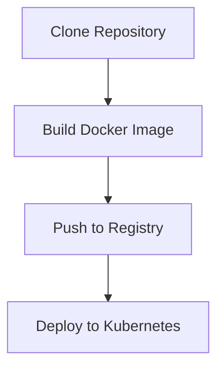

# WeatherFlow Collector - Argo Workflows Deployment

This directory contains Argo Workflows manifests for automated CI/CD deployment of the WeatherFlow Collector application.

## Overview

The Argo Workflow automates the complete deployment pipeline:
1. **Clone Repository**: Clones the GitHub repository to the workflow workspace
2. **Build Container**: Builds the Docker image with git SHA tagging
3. **Push to Registry**: Pushes images to `registry.olympusdrive.com`
4. **Deploy to Kubernetes**: Applies manifests and triggers rollout

## Prerequisites

- Argo Workflows installed in the `argo` namespace
- GitHub PAT secret configured (`github-pat-secret`)
- Persistent Volume Claim for workflow workspace (`argo-workdir-pvc`)
- Docker registry access from workflow nodes
- Nodes labeled with `argo-workflows=true`

## Usage

### Trigger Deployment

From your local machine:
```bash
cd /Users/dgorman/Dev/weatherflow-collector
./argo/trigger-deploy.sh
```

Or directly on production:
```bash
ssh dgorman@node01.olympusdrive.com
cd /home/dgorman/Apps/weatherflow-collector
kubectl create -n argo -f argo/weatherflow-collector-deploy.yaml
```

### Monitor Workflow

List all workflows:
```bash
ssh dgorman@node01.olympusdrive.com 'argo list -n argo'
```

Watch the latest workflow logs:
```bash
ssh dgorman@node01.olympusdrive.com 'argo logs -n argo @latest -f'
```

Get workflow details:
```bash
ssh dgorman@node01.olympusdrive.com 'argo get -n argo @latest'
```

### Access Web UI

Open the Argo Workflows UI in your browser:
```
https://argo.olympusdrive.com
```

## Workflow Architecture

### Workflow Steps



### Node Selector

All workflow steps run on nodes with label:
```yaml
nodeSelector:
  argo-workflows: "true"
```

### Volumes

- **workdir**: Shared PVC for git clone and build context
- **docker-socket**: Host Docker socket for building and pushing images

## Image Tagging Strategy

Each deployment creates two tags:
- `latest`: Always points to the most recent build
- `<git-sha>`: Immutable tag for specific commit (e.g., `abc1234`)

## Deployment Process

1. **Git Clone**: 
   - Clones `dgorman/weatherflow-dashboards-aio` from GitHub
   - Captures git SHA for image tagging

2. **Docker Build**:
   - Builds image using root Dockerfile
   - Tags with both `latest` and git SHA

3. **Docker Push**:
   - Pushes both tags to `registry.olympusdrive.com`

4. **Kubernetes Deploy**:
   - Updates kustomization overlay with new image tag
   - Applies manifests via kustomize
   - Triggers deployment rollout
   - Waits for successful rollout (300s timeout)

## Troubleshooting

### Workflow Fails to Start

Check if the PVC exists:
```bash
kubectl get pvc argo-workdir-pvc -n argo
```

Check if nodes are labeled:
```bash
kubectl get nodes -l argo-workflows=true
```

### Git Clone Fails

Verify GitHub PAT secret:
```bash
kubectl get secret github-pat-secret -n argo -o yaml
```

### Docker Build Fails

Check Docker socket accessibility:
```bash
kubectl describe pod <workflow-pod> -n argo
```

### Deployment Rollout Timeout

Check pod status:
```bash
kubectl get pods -n weatherflow
kubectl describe pod <pod-name> -n weatherflow
```

View deployment events:
```bash
kubectl get events -n weatherflow --sort-by='.lastTimestamp'
```

## Comparison with deploy.sh

| Feature | deploy.sh | Argo Workflow |
|---------|-----------|---------------|
| Execution | Local machine | Kubernetes cluster |
| Build Location | Remote SSH | In-cluster |
| Git Source | rsync from local | GitHub clone |
| Automation | Manual trigger | Can be automated with triggers |
| Visibility | Terminal output | Web UI + CLI |
| Retry Logic | None | Built-in Argo retry |
| Rollback | Manual | Via Argo UI |

## GitHub Webhook Integration (Future)

To enable automatic deployments on git push:

1. Create EventSource for GitHub webhooks
2. Create Sensor to trigger workflow on push events
3. Configure GitHub webhook to point to Argo Events

Example EventSource:
```yaml
apiVersion: argoproj.io/v1alpha1
kind: EventSource
metadata:
  name: github
spec:
  github:
    weatherflow:
      repositories:
      - owner: dgorman
        names:
        - weatherflow-dashboards-aio
      webhook:
        endpoint: /push
        port: "12000"
        method: POST
      events:
      - push
```

## Next Steps

1. ✅ Create Argo Workflow manifest
2. ✅ Create trigger script
3. ⬜ Test workflow execution
4. ⬜ Set up GitHub webhook automation
5. ⬜ Add Slack notifications on success/failure
6. ⬜ Implement canary deployment strategy

## Related Files

- `weatherflow-collector-deploy.yaml`: Main workflow definition
- `trigger-deploy.sh`: Helper script to submit workflow
- `../k8s/overlays/prod/kustomization.yaml`: Kustomize overlay updated by workflow
- `../deploy.sh`: Legacy deployment script (still functional)
